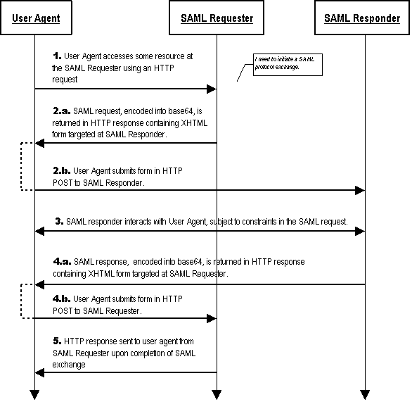

# SAML Workflow

Understand how SAML works more deeply.



[Source](https://docs.oasis-open.org/security/saml/Post2.0/sstc-saml-binding-simplesign-cd-02_html_20f95218.gif)

SAML Requestor = "Service Provider"
SAML Responder = "Identity Provider"

Got it? Great.

## Terminology

* User Agent - The User's Browser
* Identity Provider - Hosts the user login page
* Service Provider - Website server that needs the user logged in

## Steps

1) User goes to `/login` endpoint

```
GET http://web.site/login
```

2.a.) Service Provider responds with:

```
302 REDIRECT http://identity.provider/auth?SAMLRequest=QxBgpdsOxdrFA7%2B71DI0KkxG...
```

(Clarify: I think the `SAMLRequest` is encrypted with its private key)

2.b.) Browser redirects to the redirect provided

```
GET http://identity.provider/auth/
```

Note: a POST is not required

3) A Login Page is returned, User submits credentials. If credentials are correct see #4, else Identity Provider returns error to user on login page.

4.a.) Assert Returned - Identity provider returns redirect

```
302 REDIRECT POST http://web.site/assert?SAMLResponse=QxBgpdsOxdrFA7%2B71DI0KkxG...
```

`SAMLResponse` is a Base64 encoded XML SAML response. It can contain encoded data.

Example Decoded SAMLResponse: 

```
<?xml version="1.0" encoding="UTF-8"?>
<samlp:Response xmlns:samlp="urn:oasis:names:tc:SAML:2.0:protocol" xmlns:saml="urn:oasis:names:tc:SAML:2.0:assertion" Destination="http://localhost:3000/assert" ID="ID_13781ad1-92c0-480a-96d8-456becca705a" IssueInstant="2019-04-25T20:10:51.157Z" Version="2.0">
   <saml:Issuer>http://localhost:8080/auth/realms/master</saml:Issuer>
   <dsig:Signature xmlns:dsig="http://www.w3.org/2000/09/xmldsig#">
      <dsig:SignedInfo>
         <dsig:CanonicalizationMethod Algorithm="http://www.w3.org/2001/10/xml-exc-c14n#" />
         <dsig:SignatureMethod Algorithm="http://www.w3.org/2001/04/xmldsig-more#rsa-sha256" />
         <dsig:Reference URI="#ID_13781ad1-92c0-480a-96d8-456becca705a">
            <dsig:Transforms>
               <dsig:Transform Algorithm="http://www.w3.org/2000/09/xmldsig#enveloped-signature" />
               <dsig:Transform Algorithm="http://www.w3.org/2001/10/xml-exc-c14n#" />
            </dsig:Transforms>
            <dsig:DigestMethod Algorithm="http://www.w3.org/2001/04/xmlenc#sha256" />
            <dsig:DigestValue>lQKBEqHx/dxJAP3YGJdxPIAIr/ykMItG7ClQCT3pvzg=</dsig:DigestValue>
         </dsig:Reference>
      </dsig:SignedInfo>
      <dsig:SignatureValue>AigC+xo+IShKEfspmaSfk11oWbzkuRz9HCMyX/smtE4Rr3pBP7owkovzgOJsAovkPKPpe99Qy/3kb/i5O3Y4qKJSe0QqXe3sBGeHAfINFnkRmTIkRa5tQ4tttovDmO66GnoXMlvs7aXiUwO+PSLjGi8l0jQzPvzOlnXgf9pzipLQbhV346dtuOzkresEh8x9pnzHudy0ha6JJr9HvnLzte2FRAadbSAr2Rk7Jv+NnOi3mugKyfuk+x9T4iSHF+8MYE+shPCI0f8w5DMCFy+Qn4SlNK/BvdaPKcS2YYxYko0yfyNLB0d7ywmCGG67vQolPyAmyWLyeEl9XxZCtSVHxw==</dsig:SignatureValue>
      <dsig:KeyInfo>
         <dsig:KeyName>YpkpFq4q4sh7pRiHiaU3XbxQBJwjdI9yO8FlwUvl9MI</dsig:KeyName>
         <dsig:X509Data>
            <dsig:X509Certificate>MIICmzCCAYMCBgFqUnvc0DANBgkqhkiG9w0BAQsFADARMQ8wDQYDVQQDDAZtYXN0ZXIwHhcNMTkwNDI1MDMxMTUwWhcNMjkwNDI1MDMxMzMwWjARMQ8wDQYDVQQDDAZtYXN0ZXIwggEiMA0GCSqGSIb3DQEBAQUAA4IBDwAwggEKAoIBAQCYjS1dvfzVPECl5ih9BEn89LYB94lf1FMeWN9QRqwjaGj7uIu1aobBWFmkqAR3NIGsTD8E+Ne9hYjLC26n6jx8YZzdjfth43V/266LK1QpN9KIR+8DT2qK+Fmn4V9kxXvo6luyDD61Ww3c4fNjczMHMQF9hIbgLqWim+73PTQffAAo9Vfc0vMq5sFGdrsCT6oNCBgONBFVK1y+a5dOU9hqYzBXFGhdY8cHNgmK4PrJ+Q7A2e7n8IemI6PKDC+ShARjp/RAV1LpsS7qIkE5KiGFaEh5zKoLYg4ZVqlHpf3KNptGmlQBA01cnO12ozdYOwlZp+oA0uwWUiBWtxGiMubvAgMBAAEwDQYJKoZIhvcNAQELBQADggEBAGgnsZJ8/HL7MUHzHXqs/+dZx5oW6ciKONrev2CnDBnvXxGnyk4S5jw/2ogP8TGrZoQ4ma8+ZHOlW30rxW5+CeHbZ1KmIzzqScX27+SSbnGkHj8sLlzBAv122BmQHfnJmuAMHHYgAvwgHHTVPd0k8DI4wiVbev8siAxZgIiV9jY1ERo1b5e17E+AqU1asFBfrOTHB1l5vkWfU9YFomvqXP80RwJ/HXp16NBEakfUjoYceFb6kCx0NcwaOa9uQGAc2tXpQQeo5AI6I42iJWBXu1VTc7Rh50IIfrP0UCheurOuuXZyAiqKog1nhBvdAqh7xqZmz3w6HCjfQe8XH/EOMnI=</dsig:X509Certificate>
         </dsig:X509Data>
         <dsig:KeyValue>
            <dsig:RSAKeyValue>
               <dsig:Modulus>mI0tXb381TxApeYofQRJ/PS2AfeJX9RTHljfUEasI2ho+7iLtWqGwVhZpKgEdzSBrEw/BPjXvYWIywtup+o8fGGc3Y37YeN1f9uuiytUKTfSiEfvA09qivhZp+FfZMV76Opbsgw+tVsN3OHzY3MzBzEBfYSG4C6lopvu9z00H3wAKPVX3NLzKubBRna7Ak+qDQgYDjQRVStcvmuXTlPYamMwVxRoXWPHBzYJiuD6yfkOwNnu5/CHpiOjygwvkoQEY6f0QFdS6bEu6iJBOSohhWhIecyqC2IOGVapR6X9yjabRppUAQNNXJztdqM3WDsJWafqANLsFlIgVrcRojLm7w==</dsig:Modulus>
               <dsig:Exponent>AQAB</dsig:Exponent>
            </dsig:RSAKeyValue>
         </dsig:KeyValue>
      </dsig:KeyInfo>
   </dsig:Signature>
   <samlp:Status>
      <samlp:StatusCode Value="urn:oasis:names:tc:SAML:2.0:status:Success" />
   </samlp:Status>
   <saml:Assertion xmlns="urn:oasis:names:tc:SAML:2.0:assertion" ID="ID_06231286-0e5c-4cc2-823c-d3ce38009323" IssueInstant="2019-04-25T20:10:51.151Z" Version="2.0">
      <saml:Issuer>http://localhost:8080/auth/realms/master</saml:Issuer>
      <dsig:Signature xmlns:dsig="http://www.w3.org/2000/09/xmldsig#">
         <dsig:SignedInfo>
            <dsig:CanonicalizationMethod Algorithm="http://www.w3.org/2001/10/xml-exc-c14n#" />
            <dsig:SignatureMethod Algorithm="http://www.w3.org/2001/04/xmldsig-more#rsa-sha256" />
            <dsig:Reference URI="#ID_06231286-0e5c-4cc2-823c-d3ce38009323">
               <dsig:Transforms>
                  <dsig:Transform Algorithm="http://www.w3.org/2000/09/xmldsig#enveloped-signature" />
                  <dsig:Transform Algorithm="http://www.w3.org/2001/10/xml-exc-c14n#" />
               </dsig:Transforms>
               <dsig:DigestMethod Algorithm="http://www.w3.org/2001/04/xmlenc#sha256" />
               <dsig:DigestValue>gioLJAfETv2utaRRrYYaoMJppHdLhghde1H4x9pI0II=</dsig:DigestValue>
            </dsig:Reference>
         </dsig:SignedInfo>
         <dsig:SignatureValue>iYersmNkvDr6rwQp/RLCLhJ+BrOnb9RfgakaTSvE8e8QyEFQzFuAVu/wEEcVbGRoUq2Zhemyd0oCWYOgLZz5OUQdxoTVwAyuY1LHIV9bbgnF5HVZPtjDeB3Jttj/nt01PCgqayLJ+GtWaS4SPBVbJkbLnQrNUuouwwhP9ZFu85BVqZI1KHcUTHB9r7VVGMWM9VUURd5TPmkfrWzrg6XZjQ6thpKP01lktjxOSz4scfo+m91xCscR8jAa5ZR2xbFoPdI0I5zUwnKQB4+0dpN1IMtdDt/ZlhSrvSvMc/KMipjME3xFwpa/gHFbEXV0QFdpEygAZtbZ6QM+ZaAYwHwHxg==</dsig:SignatureValue>
         <dsig:KeyInfo>
            <dsig:KeyName>YpkpFq4q4sh7pRiHiaU3XbxQBJwjdI9yO8FlwUvl9MI</dsig:KeyName>
            <dsig:X509Data>
               <dsig:X509Certificate>MIICmzCCAYMCBgFqUnvc0DANBgkqhkiG9w0BAQsFADARMQ8wDQYDVQQDDAZtYXN0ZXIwHhcNMTkwNDI1MDMxMTUwWhcNMjkwNDI1MDMxMzMwWjARMQ8wDQYDVQQDDAZtYXN0ZXIwggEiMA0GCSqGSIb3DQEBAQUAA4IBDwAwggEKAoIBAQCYjS1dvfzVPECl5ih9BEn89LYB94lf1FMeWN9QRqwjaGj7uIu1aobBWFmkqAR3NIGsTD8E+Ne9hYjLC26n6jx8YZzdjfth43V/266LK1QpN9KIR+8DT2qK+Fmn4V9kxXvo6luyDD61Ww3c4fNjczMHMQF9hIbgLqWim+73PTQffAAo9Vfc0vMq5sFGdrsCT6oNCBgONBFVK1y+a5dOU9hqYzBXFGhdY8cHNgmK4PrJ+Q7A2e7n8IemI6PKDC+ShARjp/RAV1LpsS7qIkE5KiGFaEh5zKoLYg4ZVqlHpf3KNptGmlQBA01cnO12ozdYOwlZp+oA0uwWUiBWtxGiMubvAgMBAAEwDQYJKoZIhvcNAQELBQADggEBAGgnsZJ8/HL7MUHzHXqs/+dZx5oW6ciKONrev2CnDBnvXxGnyk4S5jw/2ogP8TGrZoQ4ma8+ZHOlW30rxW5+CeHbZ1KmIzzqScX27+SSbnGkHj8sLlzBAv122BmQHfnJmuAMHHYgAvwgHHTVPd0k8DI4wiVbev8siAxZgIiV9jY1ERo1b5e17E+AqU1asFBfrOTHB1l5vkWfU9YFomvqXP80RwJ/HXp16NBEakfUjoYceFb6kCx0NcwaOa9uQGAc2tXpQQeo5AI6I42iJWBXu1VTc7Rh50IIfrP0UCheurOuuXZyAiqKog1nhBvdAqh7xqZmz3w6HCjfQe8XH/EOMnI=</dsig:X509Certificate>
            </dsig:X509Data>
            <dsig:KeyValue>
               <dsig:RSAKeyValue>
                  <dsig:Modulus>mI0tXb381TxApeYofQRJ/PS2AfeJX9RTHljfUEasI2ho+7iLtWqGwVhZpKgEdzSBrEw/BPjXvYWIywtup+o8fGGc3Y37YeN1f9uuiytUKTfSiEfvA09qivhZp+FfZMV76Opbsgw+tVsN3OHzY3MzBzEBfYSG4C6lopvu9z00H3wAKPVX3NLzKubBRna7Ak+qDQgYDjQRVStcvmuXTlPYamMwVxRoXWPHBzYJiuD6yfkOwNnu5/CHpiOjygwvkoQEY6f0QFdS6bEu6iJBOSohhWhIecyqC2IOGVapR6X9yjabRppUAQNNXJztdqM3WDsJWafqANLsFlIgVrcRojLm7w==</dsig:Modulus>
                  <dsig:Exponent>AQAB</dsig:Exponent>
               </dsig:RSAKeyValue>
            </dsig:KeyValue>
         </dsig:KeyInfo>
      </dsig:Signature>
      <saml:Subject>
         <saml:NameID Format="urn:oasis:names:tc:SAML:1.1:nameid-format:unspecified">admin</saml:NameID>
         <saml:SubjectConfirmation Method="urn:oasis:names:tc:SAML:2.0:cm:bearer">
            <saml:SubjectConfirmationData NotOnOrAfter="2019-04-25T20:11:49.151Z" Recipient="http://localhost:3000/assert" />
         </saml:SubjectConfirmation>
      </saml:Subject>
      <saml:Conditions NotBefore="2019-04-25T20:10:49.151Z" NotOnOrAfter="2019-04-25T20:11:49.151Z">
         <saml:AudienceRestriction>
            <saml:Audience>demo</saml:Audience>
         </saml:AudienceRestriction>
      </saml:Conditions>
      <saml:AuthnStatement AuthnInstant="2019-04-25T20:10:51.157Z" SessionIndex="a4cfaaea-babb-46bc-b229-a9493d00a029::b99224df-42fd-420e-bc2c-2488a9a56e6b">
         <saml:AuthnContext>
            <saml:AuthnContextClassRef>urn:oasis:names:tc:SAML:2.0:ac:classes:unspecified</saml:AuthnContextClassRef>
         </saml:AuthnContext>
      </saml:AuthnStatement>
      <saml:AttributeStatement>
         <saml:Attribute Name="Role" NameFormat="urn:oasis:names:tc:SAML:2.0:attrname-format:basic">
            <saml:AttributeValue xmlns:xs="http://www.w3.org/2001/XMLSchema" xmlns:xsi="http://www.w3.org/2001/XMLSchema-instance" xsi:type="xs:string">impersonation</saml:AttributeValue>
         </saml:Attribute>
         <saml:Attribute Name="Role" NameFormat="urn:oasis:names:tc:SAML:2.0:attrname-format:basic">
            <saml:AttributeValue xmlns:xs="http://www.w3.org/2001/XMLSchema" xmlns:xsi="http://www.w3.org/2001/XMLSchema-instance" xsi:type="xs:string">query-groups</saml:AttributeValue>
         </saml:Attribute>
         <saml:Attribute Name="Role" NameFormat="urn:oasis:names:tc:SAML:2.0:attrname-format:basic">
            <saml:AttributeValue xmlns:xs="http://www.w3.org/2001/XMLSchema" xmlns:xsi="http://www.w3.org/2001/XMLSchema-instance" xsi:type="xs:string">manage-realm</saml:AttributeValue>
         </saml:Attribute>
         <saml:Attribute Name="Role" NameFormat="urn:oasis:names:tc:SAML:2.0:attrname-format:basic">
            <saml:AttributeValue xmlns:xs="http://www.w3.org/2001/XMLSchema" xmlns:xsi="http://www.w3.org/2001/XMLSchema-instance" xsi:type="xs:string">manage-events</saml:AttributeValue>
         </saml:Attribute>
         <saml:Attribute Name="Role" NameFormat="urn:oasis:names:tc:SAML:2.0:attrname-format:basic">
            <saml:AttributeValue xmlns:xs="http://www.w3.org/2001/XMLSchema" xmlns:xsi="http://www.w3.org/2001/XMLSchema-instance" xsi:type="xs:string">uma_authorization</saml:AttributeValue>
         </saml:Attribute>
         <saml:Attribute Name="Role" NameFormat="urn:oasis:names:tc:SAML:2.0:attrname-format:basic">
            <saml:AttributeValue xmlns:xs="http://www.w3.org/2001/XMLSchema" xmlns:xsi="http://www.w3.org/2001/XMLSchema-instance" xsi:type="xs:string">view-clients</saml:AttributeValue>
         </saml:Attribute>
         <saml:Attribute Name="Role" NameFormat="urn:oasis:names:tc:SAML:2.0:attrname-format:basic">
            <saml:AttributeValue xmlns:xs="http://www.w3.org/2001/XMLSchema" xmlns:xsi="http://www.w3.org/2001/XMLSchema-instance" xsi:type="xs:string">query-realms</saml:AttributeValue>
         </saml:Attribute>
         <saml:Attribute Name="Role" NameFormat="urn:oasis:names:tc:SAML:2.0:attrname-format:basic">
            <saml:AttributeValue xmlns:xs="http://www.w3.org/2001/XMLSchema" xmlns:xsi="http://www.w3.org/2001/XMLSchema-instance" xsi:type="xs:string">manage-account</saml:AttributeValue>
         </saml:Attribute>
         <saml:Attribute Name="Role" NameFormat="urn:oasis:names:tc:SAML:2.0:attrname-format:basic">
            <saml:AttributeValue xmlns:xs="http://www.w3.org/2001/XMLSchema" xmlns:xsi="http://www.w3.org/2001/XMLSchema-instance" xsi:type="xs:string">view-profile</saml:AttributeValue>
         </saml:Attribute>
         <saml:Attribute Name="Role" NameFormat="urn:oasis:names:tc:SAML:2.0:attrname-format:basic">
            <saml:AttributeValue xmlns:xs="http://www.w3.org/2001/XMLSchema" xmlns:xsi="http://www.w3.org/2001/XMLSchema-instance" xsi:type="xs:string">create-realm</saml:AttributeValue>
         </saml:Attribute>
         <saml:Attribute Name="Role" NameFormat="urn:oasis:names:tc:SAML:2.0:attrname-format:basic">
            <saml:AttributeValue xmlns:xs="http://www.w3.org/2001/XMLSchema" xmlns:xsi="http://www.w3.org/2001/XMLSchema-instance" xsi:type="xs:string">create-client</saml:AttributeValue>
         </saml:Attribute>
         <saml:Attribute Name="Role" NameFormat="urn:oasis:names:tc:SAML:2.0:attrname-format:basic">
            <saml:AttributeValue xmlns:xs="http://www.w3.org/2001/XMLSchema" xmlns:xsi="http://www.w3.org/2001/XMLSchema-instance" xsi:type="xs:string">manage-authorization</saml:AttributeValue>
         </saml:Attribute>
         <saml:Attribute Name="Role" NameFormat="urn:oasis:names:tc:SAML:2.0:attrname-format:basic">
            <saml:AttributeValue xmlns:xs="http://www.w3.org/2001/XMLSchema" xmlns:xsi="http://www.w3.org/2001/XMLSchema-instance" xsi:type="xs:string">query-clients</saml:AttributeValue>
         </saml:Attribute>
         <saml:Attribute Name="Role" NameFormat="urn:oasis:names:tc:SAML:2.0:attrname-format:basic">
            <saml:AttributeValue xmlns:xs="http://www.w3.org/2001/XMLSchema" xmlns:xsi="http://www.w3.org/2001/XMLSchema-instance" xsi:type="xs:string">view-identity-providers</saml:AttributeValue>
         </saml:Attribute>
         <saml:Attribute Name="Role" NameFormat="urn:oasis:names:tc:SAML:2.0:attrname-format:basic">
            <saml:AttributeValue xmlns:xs="http://www.w3.org/2001/XMLSchema" xmlns:xsi="http://www.w3.org/2001/XMLSchema-instance" xsi:type="xs:string">view-authorization</saml:AttributeValue>
         </saml:Attribute>
         <saml:Attribute Name="Role" NameFormat="urn:oasis:names:tc:SAML:2.0:attrname-format:basic">
            <saml:AttributeValue xmlns:xs="http://www.w3.org/2001/XMLSchema" xmlns:xsi="http://www.w3.org/2001/XMLSchema-instance" xsi:type="xs:string">view-users</saml:AttributeValue>
         </saml:Attribute>
         <saml:Attribute Name="Role" NameFormat="urn:oasis:names:tc:SAML:2.0:attrname-format:basic">
            <saml:AttributeValue xmlns:xs="http://www.w3.org/2001/XMLSchema" xmlns:xsi="http://www.w3.org/2001/XMLSchema-instance" xsi:type="xs:string">view-realm</saml:AttributeValue>
         </saml:Attribute>
         <saml:Attribute Name="Role" NameFormat="urn:oasis:names:tc:SAML:2.0:attrname-format:basic">
            <saml:AttributeValue xmlns:xs="http://www.w3.org/2001/XMLSchema" xmlns:xsi="http://www.w3.org/2001/XMLSchema-instance" xsi:type="xs:string">manage-identity-providers</saml:AttributeValue>
         </saml:Attribute>
         <saml:Attribute Name="Role" NameFormat="urn:oasis:names:tc:SAML:2.0:attrname-format:basic">
            <saml:AttributeValue xmlns:xs="http://www.w3.org/2001/XMLSchema" xmlns:xsi="http://www.w3.org/2001/XMLSchema-instance" xsi:type="xs:string">query-users</saml:AttributeValue>
         </saml:Attribute>
         <saml:Attribute Name="Role" NameFormat="urn:oasis:names:tc:SAML:2.0:attrname-format:basic">
            <saml:AttributeValue xmlns:xs="http://www.w3.org/2001/XMLSchema" xmlns:xsi="http://www.w3.org/2001/XMLSchema-instance" xsi:type="xs:string">offline_access</saml:AttributeValue>
         </saml:Attribute>
         <saml:Attribute Name="Role" NameFormat="urn:oasis:names:tc:SAML:2.0:attrname-format:basic">
            <saml:AttributeValue xmlns:xs="http://www.w3.org/2001/XMLSchema" xmlns:xsi="http://www.w3.org/2001/XMLSchema-instance" xsi:type="xs:string">manage-users</saml:AttributeValue>
         </saml:Attribute>
         <saml:Attribute Name="Role" NameFormat="urn:oasis:names:tc:SAML:2.0:attrname-format:basic">
            <saml:AttributeValue xmlns:xs="http://www.w3.org/2001/XMLSchema" xmlns:xsi="http://www.w3.org/2001/XMLSchema-instance" xsi:type="xs:string">admin</saml:AttributeValue>
         </saml:Attribute>
         <saml:Attribute Name="Role" NameFormat="urn:oasis:names:tc:SAML:2.0:attrname-format:basic">
            <saml:AttributeValue xmlns:xs="http://www.w3.org/2001/XMLSchema" xmlns:xsi="http://www.w3.org/2001/XMLSchema-instance" xsi:type="xs:string">view-events</saml:AttributeValue>
         </saml:Attribute>
         <saml:Attribute Name="Role" NameFormat="urn:oasis:names:tc:SAML:2.0:attrname-format:basic">
            <saml:AttributeValue xmlns:xs="http://www.w3.org/2001/XMLSchema" xmlns:xsi="http://www.w3.org/2001/XMLSchema-instance" xsi:type="xs:string">manage-account-links</saml:AttributeValue>
         </saml:Attribute>
         <saml:Attribute Name="Role" NameFormat="urn:oasis:names:tc:SAML:2.0:attrname-format:basic">
            <saml:AttributeValue xmlns:xs="http://www.w3.org/2001/XMLSchema" xmlns:xsi="http://www.w3.org/2001/XMLSchema-instance" xsi:type="xs:string">manage-clients</saml:AttributeValue>
         </saml:Attribute>
      </saml:AttributeStatement>
   </saml:Assertion>
</samlp:Response>
```

4.b.) Browser submits SAML to `/assert` Service Provider endpoint

Service provider decodes the `SAMLResponse`, validates signatures, etc.

This is where a session token could be created in the Service Provider

Here's some of the information returned from the request:

```
{
  response_header: {
    version: "2.0",
    destination: "http://localhost:3000/assert",
    id: "ID_e92f0c60-c906-44a3-ac0f-2e6491c5455c"
  },
  type: "authn_response",
  user: {
    name_id: "admin",
    session_index: "a4cfaaea-babb-46bc-b229-a9493d00a029::b99224df-42fd-420e-bc2c-2488a9a56e6b",
    attributes: {
      Role: [
        null
      ]
    }
  }
}
```

5) Successful Response Returned

The Service Provider returns a 200. 

This is where a website would generally return a session cookie to associate future requests with the user making them.
